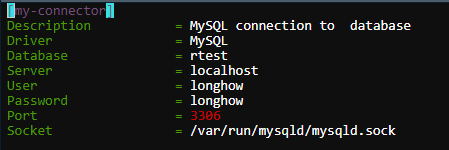
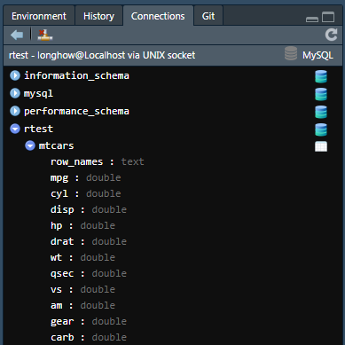

---

<br>


# Introduction.

---

## The RStudio environment

Start with powerpoint slides over R, followed by intro in RStudio:

* Console,
* Script windows,
* Environment tab (Object browser),
* Packages.


## R Projects

Organize your work in R Projects. A project can be made up of multiple verschillende scripts, notebooks, data and output. For practical purposes these should be stored in one project folder. RStudio makes it easy to work with multiple projects. Via the GUI you can create and manage new projects.
File > New Project...


## Scripts 

Scripts, are simple text files (*.R) with R code. In RStudio you can open and manage multiple scripts. Scripts that belong together can be put into an R Project. Via File menu > New File > R Script you can make a new R script file. You can also use the short cut Ctrl+Shift+N.

Type R code in a script and put your cursor at a line. By pressing Ctrl+enter you can run this line of code. It’s also possible to select multiple lines and running the code for those. For more options see the Code menu and “Run Region”.


## R Notebooks

R notebooks contain much more than R code alone. It is a ‘complete’ document with code, output, and a descriptive storyline. In a R project it is possible to manage multiple notebooks and scripts. Notebooks can e created with Rmarkdown, a form of lightweight markup language in which headers, figures, and bold formatting can be specified. This R course uses R notebooks. A notebook contains **R code chunks** that can be run.

When you click the Preview button above the R notebook a new window wil open with the **result from the R notebook**. Rstudio will also create a seperate file with the name <file_name>.nb.html. This html file can be shared with others.

Besides the nb.html, an R notebook can also be knitted to a html, pdf or Word document. The header of the markdown document describes how the document can be expanded. Next to the Preview button there is an arrow select from which you can choose.

## The R Console

The R Console is a place where it is possible to run a snippet of code. Type an R expression and press Enter to run it. Outputs from scripts will also appear in the R Console.

## Git version controle

Git is een version control system. In RStudio it is easy to use git as well. You will have to install it first though. On Windows you can install git via [the git site](https://git-scm.com/download/win). In this course we will not further delve into this.

## A couple of simple expressions

Below a few simple expressions in R to get started

```{r, eval=FALSE}
1 + 1
print("hello world")

## assignment you can use = or <- ,
## The arrow come from a time where it was a key on a keybord

## When you run the line below an object test will be made, nothing else will be shown.
test = 9

## To see what object test contains the contents must be printed.
## This can be done by running the line below
print(test)

## Since it is often necessary to view the contents of an object the name alone suffices
## run the line below
test

## When an object already exists it is overwritten without warning
test <- 3
test
```

In R names of objects are **case-sensitive!**. The # are used to place comment in code. Everything following a bracket wil not be run.

```{r, eval=FALSE}
x = 8
X = 8

ls()

786 / (87 +87)

## some mathematical calculations 
pi / asin(1)
exp(1) 
log(10)

##### integer calculations

# devide thirteen by five
13 / 5
# 5 fits two times in 13
13 %/% 5
# the remainder is 3
13 %% 5
```

Help in R is <F1> .


<br>

# Data types

---
All data in R is of a certain type. Below we’ll discuss the different types of data. With the function ‘typeof’ you can always query the type of an object in R.

## Numerical data

### double

The `double` datatype in R is often used to represent numerical values (common numbers). For example humans have characteristics like length (1.85) and weight (78.8).

```{r, eval=FALSE}
x4 = 4
x5 = 5.6 / 8

x6 = pi/2

is.double(x4)

```

### integer

The`integer` data type in R also represents numeric valaues. however, unlike doubles they only represent rounded numbers. Example: any number of number of children (0, 1, 2,...).

```{r, eval=FALSE}
# be aware: the values below are doubles in R.
x = 1
y = 2

is.integer(x)

x = as.integer(1)
z = x + 9.78

is.integer(z)

y = 34L
is.integer(y)

x7 = 4L
is.double(x7)

# Unlike other languages, within R you can use double and integers
# in calculations without translations

x8 = x4 + x7
typeof(x8)
```

## character

In R the ‘character` data type can store text (sometimes called strings). Edits and manipulations of characters will be shown in session 2.

```{r, eval=FALSE}
x1 = "Longhow Lam"
x2 = "1628 AA Hoorn"

is.character(x1)

nchar(x2)

x3 = paste(x1, x2)
x3 = paste(x1, x2, sep="")
x3 = paste0(x1, x2)
```


## factor

In R `factors` are meant to represent categorical variables. Per example these can be gender or education. Don’t confuse a factor with the type character. Factor variables can be made into character variables. In some predictive modeling functions you will explicitly need factor variables and not character.


Data sets often contain names or last names of people of the type character but often also gender or education of the type factor.

```{r, eval=FALSE}
x3 = c("M", "F", "M")

is.character(x3)
typeof(x3)

y3 = as.factor(x3)
x3
y3
```

Dit is wel apart

```{r, eval=FALSE}
typeof(y3)
is.character(y3)
is.factor(y3)
is.integer(y3)

levels(y3)
levels(x3)

# Be aware of the difference between factors and characters!
```

Sometimes there exists an order in the different levels. In R this can be made explicit with ordered factors. Say you have an income object with four observations: low, high, medium and medium.

```{r, eval = FALSE}
inkomen = as.factor(
  c("low", "high", "medium", "medium")
)

as.integer(income)
# medium is translated to 3 vertaald, for medium is alphabetically placed highest.

income = ordered(income, levels = c("low", "medium", "high"))
```
 

## logical

When in R a test is run, then the result is of the type `logical`. We already say the fucntions `is.double` ann `is.integer`.

```{r, eval=FALSE}
x7 = TRUE
x8 = FALSE

typeof(x7)

x9 = x6 < 8

is.logical(x9)
```

The following snippet of code shows logical operators.

```{r, eval=FALSE}
# an ampersand is the 'AND' operator
TRUE & FALSE    # AND

x = 9
x < 10 & x > 5

# negation, opposite
!TRUE           # NOT
!FALSE

# vertical pipe is the 'OR' operator
TRUE | FALSE    # OR
x < 7 | x > 8
```

You can do calculations with logicals

```{r, eval = FALSE}
TRUE + TRUE
FALSE + FALSE + TRUE

### Hmmm something strange at first glance...

0.1 + 0.2 == 0.3

1 + 2 == 3
x = 0.3

sprintf("%.16f", x)
sprintf("%.24f", x)
```


## infinity

In R there is a special symbol for infinity

```{r, eval=FALSE}
x1 = 9/0
x2 = -x1
x1
is.infinite(x2)
```

## missing value

Missing values can in R be represented with ‘NA’. You can have missing doubles, integers, etc.

```{r, eval=FALSE}
x3 = NA

# use is.na to check if something is NA
is.na(x3)

# a row of numbers where one is missing
x4 = c(1, 2, 3, 4, NA, 5, 7)

# How many elements are NA or not NA
sum(is.na(x4))
sum(!is.na(x4))

x4 < 4

is.na(x4)
```


## Where are my objects

When you’ve defined a few objects in R then these are located in the so called 'Global Environment'. You will see the objects in the 'Environment' window, or you can request them with functions.

```{r, eval=FALSE}
# Request objects in R
ls()
objects()
```

When R starts there are also a few libraries present. These also contain objects. What is a search path...

```{r, eval=FALSE}
Pete  # is not found
cars # is found

### Objects are located through a search path:
search()

objects(pos = 5)

## these are found

OrchardSprays
iris
iris = 9

## What is now stored in iris and is my old iris lost?
iris
```

Via the 'Environment' window you can see which objects are stored in libraries. Select another library than 'Global Environment'.

### Removing objects

```{r, eval=FALSE}
x = 5
rm(x)

## Removing objects standard only from the working directory, the ‘current session’

iris
rm(iris)

datasets::iris

rm(iris)

########   Storing of objects and work directory
x = 45

# Save a specific object
saveRDS(x, file = "ObjectX.Rds")

# Save a whole image, this will be asked when closing down Rstudio
save.image()
```

Via the 'Environment' window you can also remove objects. It can be done all at once with the ‘broom’ or, when you seitch from List mode to Grid mode, you can select objects for removal.

<br>

# Data structures

---

Data in R can appear in multiple forms, the so called data structures. We will look at a few basic structures below.

## vectors

Vectors are used to store a ‘row’ of elements. You can have a vector which contains doubles, characters, etc.. All elements of vector have to be the same type.

```{r, eval=FALSE}
## a number is also a vector, with a length of 1
x0 = 1

x1 = c( 1, 2, 3, 4, 5)
length(x1)
class(x1)

x2 = c(2L, 3)
typeof(x2)

x3 = c("p", 2)
```

There are different functions in R that can be used to generate vectors without having to type all elements 1 by 1.

```{r, eval = FALSE}
x1 = 1:1000
x1 = 187:278

x2 = seq(1, 50, length=100)
x2a = seq(1,500, by = 20)

## merging two or more vectors
x3 = c( x0, rnorm(100))

class(x4)
```

The generation of multiple numbers is useful when data is needed for testing. R has several functions for this:

```{r, eval=FALSE}
# normal distributed numbers
rnorm(100)
rnorm(100, 9, 2)

#uniform distributed numbers
runif(100)
runif(100,8,10)

# pull from a vector
x4 = sample( letters, rep = TRUE, size = 100)
```

calculations on vectors happen element-wise 

```{r, eval=FALSE}
y = 3 * x3 + 8

## and what is this???
y = x4 + 8

x4 = rep(1:6, 7)
x4 = rep(x4,8)

x5 = rep(1:10, each = 3)
```

Use the function `cut` to make factor vectors from double vectors

```{r}
x <- rnorm(100)
y <- cut(x, 4)
```

### subscripting of vectors

Subscripts can be used to approach elements in a vector.

```{r, eval=FALSE}
## R starts counting atj 1
x3 = 100:200

## subscripts are : 1 number, a vector of numbers, negative numbers
x3[1]
x3[  4:10  ]
x3[  -(1:10)]

## broken numbers are also an option
x3[8.9]

## subscripts can also be used to change elements
x3[  8:17  ] = 0
```

It’s also possible to submit a vector of TRUE/FALSE as subscript

```{r, eval=FALSE}
x = rnorm(100)
x[x > 2]

```

A few simple functions that can be applied to vectors

```{r, eval=FALSE}
y = rnorm(1000)

mean(y)
var(y ) 
min(y)
sd(y)
max(y)
summary(y)

sum(y < 0)
```


##  Matrices

A matrix is a collection of vectors that are equally long. It is possible to have rectangular (rows unequal to columns) or squared (rows equal to columns) matrices.

```{r, eval=FALSE}
## create a matrix from
m1 = rnorm(100)
m2 = matrix(m1, byrow = FALSE, ncol=10)
m2
dim(m2)
class(m2)

## Create a matrix from a number of vectors
x = 1:10
y = 10:1
z = 11:20

m3 = cbind(x,y,z)
m4 = rbind(x,y,z)
```

Like vectors, elements in a matrix can be approached with subscripts. A few examples are listed below.

```{r, eval = FALSE} 
m2[1,5]

m2[  4:10,    3:5]

m2[5,]

m2[ ,5]
```

With matrices calculations can be made. 

```{r, eval =FALSE}
# determinant of a matrix
det(m2)

# transposing a matrix 
t(m2)

# inverse of a matrix
solve(m2)

# two types of multiplications of matrices
m2 %*% solve(m2)
m2 * solve(m2)

round(m2 %*% solve(m2))
```

## multidimensional arrays

I R, arrays are multi-dimensional matrices. In 3 dimensions these can be seen as blocks of numbers.

```{r, eval=FALSE}
m = array(1:1000, dim = c(10,10,10))

m[1,5,7]

m[1,4,  ]

m[,4,]
class(m)
```


## data frames

A data frame can be seen as a matrix, but unlike a matrix can columns of a data frame be of a different type. For data analyses with real data a data.frame will supply the best structure. You can have, per example, a factor column “gender”, a double column with “weight” and character column with ‘last name’.

```{r, eval=FALSE}
x1 = 1:100
x2 = rnorm(100)
x3 = rnorm(100)
x4 = sample(c("M","F"), size = 100, replace = TRUE)

df1 = data.frame(
  columnnamej1 = x1,
  income = x2,
  age = x3,
  gender = x4
)

# show first 10 rows
head(df1,10)
```

*Beware!!* In the code above is ‘x4’ a character vector, but in the data frame the column gender has become a factor data type. This is standard behavior of the function data.frame. Use the argumnet `stringAsFactors = FALSE` to not automatically convert to factor variables.

```{r eval=FALSE}
df1 = data.frame(
 columnnamej1 = x1,
  income = x2,
  age = x3,
  gender = x4,
  stringsAsFactors = FALSE
)
```

The following funcitons can be used to view extra information of a data frame. 

```{r, eval=FALSE}
# show the names of the columns
names(df1)

# names can also be used to edit the column names
df2 = df1
names(df2) = c("A", "B", "C", "D")

# dimension and class of a data frame
dim(df1)
class(df1)
```

To get an impression of what is stored in a data.frame you can use `summary` or `skimr` 

```{r, eval = FALSE}
summary(mtcars)
summary(iris)
```

The package `skimr` you hae to install first.

```{r, eval = FALSE}
devtools::install_github("hadley/colformat")
devtools::install_github("ropenscilabs/skimr")

library(skimr)
skimr::skim(mtcars)
skim(iris)
```


Like with matrices it is possible to use subscripts in data frame to collect data from a data.frame

```{r, eval=FALSE}
df1[1,3]
df1[11:20,]

df1[, 2:3]
df1$income

## add column
df1$NEW = df1$income / 100
df1
```


## tibbles

In R tibbles are a modern version of data.frames, invented by Hadley Wickham. Tibbles have a few advantages. They have a slightly better print method and never transform character to factor.
For more see his book and website [tibbles.](http://tibble.tidyverse.org/)

```{r, eval=FALSE}
library(tibble)

x1 = 1:100
x2 = rnorm(100)
x3 = rnorm(100)
x4 = sample(c("M","F"), size = 100, replace = TRUE)

tb1 = tibble(
  columnname1 = x1,
  income = x2,
  age = x3,
  type = x4
)

## output in notebooks aren’t different but in the console this is the case
df1
tb1

## extracting of column is consistent 
df1[,1:2]
df1[,1]

tb1[,1:2]
tb1[,1]
```


## lists

In R lists are a the most generic data structure. It can be considered to be a colleciton of other data structures. A lists can contain a list, and lists sometimes are the result of a function that returns all kinds of things in a list. 

```{r, eval=FALSE}
m2 = matrix(rnorm(100), ncol=10)
mydf = mtcars

## put a few objects in a list
l1 <- list( a = 1, b = 1:100, c = m2, d = mydf)

## a list can contain another list
l2 <- list (zz = rnorm(100), pp = l1)
```

lists exist from different component. How can these components be approached or can you pull things from a list? This can be done with subscripts or with a name.

```{r, eval=FALSE}
## subscripts
l2[[1]]
l2[1]

l2[[2]][[4]][[3]][5:9]

## or by name
l1$age[5:9]

l1[[3]]

l1$c[1,4]
l1[[4]]$x2[3]
```

Additional components can be added to a list

```{r, eval=FALSE}
l1$PP = 1

# Overview of components in a list+
names(l1)

# component 6 can also be changed
l1[[6]] = 8

## This completes the list with components 7, 8 which are NULL 
l1[[9]] = 100
l1
```


##  functions in R

We will briefly discuss functions in R. A function is a object in the same way we already have multiple objects in R. We also write a function.

```{r, eval=FALSE}
x = 1:10 
y = 1:10

# this is not a function...
f1 <- x + y
```

Use `function` to write a function yourself. Two simple examples:

```{r, eval=FALSE}
f1 = function(x, y){
  t1 = 2*y
  t2 = 3*x
  t1 + t2
}

## The last line is returned
f1(8,6)
```

If you want to leave the function earlier with a value, use ‘return’ in the function.

```{r, eval=FALSE}
f2 = function(x){
  if (x < 0){
    return(1)
  }
  else
  {
    return(0)
  }
}

f2
f2(-9)

## a simple loop to calculate a sum

f3 = function(x)
{
  n = length(x)

  out = 0  
  for(i in 1:n)
  {
    out = out + x[i] 
  }
  return(out)
}

f3( 1:1000)

# we can simply do
sum(1:1000)
```

###   The %>%  pipe (or chain) operator

The chain operator is used to to give the result of a function to another function. The code below gives a very simple example

```{r, eval=FALSE}
tan(cos(sin(0.33)))

0.33 %>% sin %>% cos %>% tan

0.33 %>% 
  sin %>%
  cos %>% 
  tan
```

This is usually used to make the code more readable. We will discuss this more in the second session.

<br>


# Importn / export data 

---

When working in R you will need data. The way we made data in the examples above is not representative of real datasets. These live in databases or in files.

## Reading files

A few packages that can be used to read files

* `readr` package, for text files
* `haven` package for files of SAS, SPSS, Stata
* `readxl` for Excel files

R also has standard functions for the importing of text files, but I often use the functions from the package `readr`. For big files this is much faster. You will also see a progress bar. In Rstudio the import functions can be called via the** Import Dataset ** GUI that accompanies the reading of data.


```{r, eval=FALSE}
### data with restaurants in the Netherlands
library(readr)
Restaurants = read_csv("data/Restaurants.csv")

### Reading Excel files
library(readxl)
test = read_excel(
  "data/test.xlsx",
  range = "D8:F14"
)
```


## R Datasets (RDS)

You can write R pobjhects (not only data frames) with the ‘saveRDS’ funciton. These can then be read with the ‘readRDS’ function. The files that are created in this way are binary. They are smaller than text files and can be read by R faster.

```{r, eval=FALSE}
x = rnorm(100)
saveRDS(x, "data/x.RDs")

rm(x)
x = readRDS("data/x.RDs")

GasPedal = readRDS("data/AllCarsGasPedaal.Rds")
```


## Reading from a database

Data from external databases, like MySQL, Oracle, Apache, HIVE, or SQL Server can be used in R by linking R to the database. You can use ODBC to connect to a database and in Linux you can specify the properties in a config file.



Now that there is a connection named `my-connector` we can use that in R to connect. 

```{r, eval = FALSE}
library(odbc)
library(DBI)
library(dplyr)
con_sql <- dbConnect(odbc::odbc(), "my-connector")
cars = tbl(con_sql, "mtcars")
```

In the RStudio GUI you can see (only for certain connectiions) the data tables in the data base server.



For more details on connecting R to data bases see [this website](https://db.rstudio.com/overview).


# More about memory usage

R processes everything in the RAM memory of the computer. It is useful to know how much memory R uses and how big objects are. The package `pryr` contains useful functions for this.

```{r, eval=FALSE}
library(pryr)

### how much memory is required for an object with 1 miljoen numbers?
x = rnorm(1e6)
object_size(x)

### how much memory have we used in total?
mem_used()

### changing memory
mem_change(
  y <- rnorm(1e7)
)
mem_used()


### removing an object
rm(y)
mem_used()

```

Via the 'Environment' tab it is also possible to see per object how large it is. Change from 'List' view to 'Grid' view.


==== END OF SESSION===


